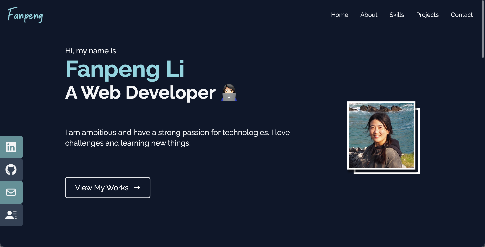

# Hi, Fanpeng here 👩🏻‍💻

Have a look at my portfolio! **[Click here: 🔗](https://fanpeng-portfolio.netlify.app/)**

(Build with: `tailwind`, `react`, `JavaScript`)

👀 Preview:

 

### 🙋🏻‍♀️ By the way, to try the code

Clone the repo and run `npm start`

Open [http://localhost:3000](http://localhost:3000) to view it in your browser.
